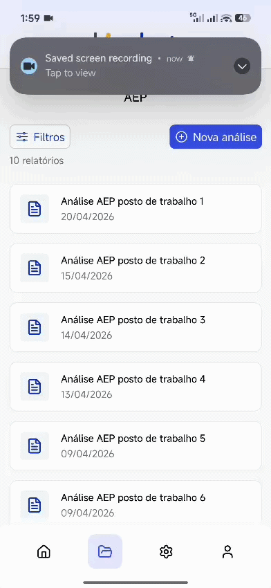

# Kinebot AEP — App de Análise Ergonômica Preliminar

App mobile (React Native + Expo) para gestão de **Análises Ergonômicas Preliminares (AEP)**. O usuário autentica, navega por uma lista de análises de postos de trabalho, visualiza o resultado de risco em um gráfico de pizza e realiza todo o CRUD consumindo a API REST fornecida.

Desenvolvido como teste técnico para a vaga de **Desenvolvedor(a) Mobile Pleno (React Native)**.

---

## Sumário

- [Demonstração](#demonstração)
- [Stack principal](#stack-principal)
- [Como rodar o projeto](#como-rodar-o-projeto)
- [Arquitetura e organização de pastas](#arquitetura-e-organização-de-pastas)
- [Decisões técnicas](#decisões-técnicas)
- [Telas e premissas adotadas](#telas-e-premissas-adotadas)

---

## Demonstração

<p align="center">
  
  
  
</p>

<p align="center">
  <em>Splash &nbsp;•&nbsp; Login (com animação da logo) &nbsp;•&nbsp; Lista de análises</em>
</p>

---

## Stack principal

| Área | Escolha |
| --- | --- |
| Setup | **Expo** (managed) + **Expo Router** (navegação por arquivos) |
| Linguagem | **TypeScript** (componentes funcionais + Hooks) |
| Estado de servidor | **TanStack Query** integrado via **jotai-tanstack-query** |
| Estado de cliente | **Jotai** (atoms, inclusive persistidos) |
| HTTP | **Axios** (instância com interceptors) |
| Formulários | **React Hook Form** + **Zod** (validação via `@hookform/resolvers`) |
| Estilização | **NativeWind** (Tailwind) + **Gluestack UI** |
| Ícones | **lucide-react-native** |
| Gráfico de pizza | **react-native-pie-chart** |
| Persistência | **AsyncStorage** + **Expo Secure Store** |
| UX extra | Blur nativo nos modais, **Reanimated**, keyboard controller, toasts |

---

## Como rodar o projeto

### Pré-requisitos
- Node.js LTS
- `pnpm` (o projeto usa `pnpm-lock.yaml`) — ou `npm`/`yarn`
- App **Expo Go** no celular, ou um emulador Android / simulador iOS

### Passos

```bash
# 1. Instalar dependências
pnpm install

# 2. Configurar variáveis de ambiente (ver abaixo)
#    crie/edite o arquivo .env na raiz

# 3. Iniciar o bundler
pnpm start
```

A partir do output do Expo você pode abrir no Expo Go (QR Code), no emulador Android (`a`) ou no simulador iOS (`i`).

### Variáveis de ambiente

O arquivo `.env` na raiz define a base URL da API. O prefixo `EXPO_PUBLIC_` é obrigatório para que a variável fique disponível no cliente:

```bash
EXPO_PUBLIC_API_URL_PROD=https://technical-test-api-zo3r.onrender.com/api/<seu-workspace>
```

> Substitua `<seu-workspace>` pelo workspace único do candidato, conforme a Referência da API.

> ⚠️ A API hiberna quando ociosa — a **primeira requisição pode levar alguns segundos** (cold start). Os dados resetam quando o serviço reinicia.

### Credenciais de acesso (login local, hardcoded)

```
e-mail: teste@kinebot.com.br
senha:  123456
```

### Scripts úteis

```bash
pnpm start       # inicia o Expo
pnpm android     # build/run no Android
pnpm ios         # build/run no iOS
pnpm lint        # expo lint
pnpm typecheck   # tsc --noEmit
```

### Gerar APK de produção (para testar em dispositivo real)

Para facilitar o teste por outras pessoas, há scripts que geram um **APK release** — assim dá para instalar direto num aparelho Android e avaliar a versão de produção, com **mais performance** do que rodar via Expo Go/dev.

```bash
pnpm set-version       # seletor interativo de versão (patch/minor/major) — opcional
pnpm gen-apk-release   # bump de versão + build release (gradlew assembleRelease) + cópia do APK
```

O `gen-apk-release` executa o fluxo completo e, ao final, copia o `.apk` para `apk/kinebot-aep-<versão>.apk` na raiz do projeto (via `copy-apk`). É só compartilhar esse arquivo com quem for testar.

> Requer o ambiente Android nativo configurado (Android SDK / `ANDROID_HOME`), já que faz um build local com Gradle. O `set-version` também sincroniza a versão entre `package.json`, `app.json` e `android/app/build.gradle`.

---

## Arquitetura e organização de pastas

A navegação usa **Expo Router**, com separação física e clara entre o fluxo **não autenticado** e o **autenticado**:

```
src/
├── app/                      # Rotas (Expo Router)
│   ├── (auth)/               # Fluxo NÃO autenticado
│   │   ├── login.tsx
│   │   └── forgotpass.tsx
│   └── (protected)/          # Fluxo autenticado (gate de sessão)
│       ├── (tabs)/           # Tab bar (home, analyses, user, config)
│       │   ├── home.tsx
│       │   ├── analyses/     # Lista + filtros (modal)
│       │   ├── user/         # Perfil do usuário
│       │   └── config.tsx
│       └── analyse/          # Detalhe, criação e edição de análise
│           ├── [id]/         # Detalhe + gráfico + ações
│           ├── create.tsx
│           ├── edit/[id].tsx
│           └── components/AnalysesForm.tsx   # form reaproveitado (criar/editar)
│
├── api/                      # Camada de dados
│   ├── axios.config.ts       # instância Axios + interceptors (token / 401)
│   ├── endpoints/            # services (analyses, auth)
│   └── schemas/              # schemas Zod (validação e tipos)
│
├── atoms/                    # Estado global (Jotai)
│   ├── auth/                 # token e usuário (persistidos)
│   └── api/                  # queries e mutations (jotai-tanstack-query)
│
├── auth/                     # AuthProvider + hooks de sessão
├── components/               # Componentes reutilizáveis (layout, form, modal...)
├── toasts/                   # Mensagens de feedback (sucesso/erro)
└── env-config.ts             # leitura tipada das envs
```

**Por que essa separação:** cada tela tem suas próprias `sections/`, `modals/`, `context.tsx` e `atoms.ts` colocados ao lado da rota (colocation), o que mantém o domínio coeso e fácil de navegar. A camada de API é isolada em `services` (chamadas) → `atoms` (queries/mutations) → telas, deixando os componentes desacoplados do transporte HTTP.

---

## Decisões técnicas

- **Expo + Expo Router** — setup rápido e navegação por arquivos, que torna a fronteira `(auth)` / `(protected)` explícita no próprio sistema de arquivos.
- **Jotai + TanStack Query** — `jotai-tanstack-query` une o cache/estados de servidor do React Query (loading, erro, refetch, invalidação) à ergonomia dos atoms do Jotai. Toda chamada de API expõe `isPending` / `error`, atendendo ao requisito de **tratar loading e erro**.
- **CRUD 100% via API** — `analysesService` cobre `GET` (lista e detalhe, com suporte a `_sort`, `_order`, `_page`, `_limit`, `q` e filtros por campo), `POST`, `PUT`, `PATCH` e `DELETE`. Após criar/editar/excluir, as queries são invalidadas e a lista volta atualizada.
- **Sessão persistente** — com **"Lembrar de mim"** ativo, o token é persistido (Secure Store / AsyncStorage via `atomWithStorage`). Ao reabrir o app, a splash é mantida enquanto a sessão é restaurada e o usuário vai direto para a área autenticada.
- **Login local** — a validação é feita contra as credenciais hardcoded (sem API), conforme o enunciado.
- **React Hook Form + Zod** — formulários tipados e validados, com schemas compartilhados entre validação e tipos.
- **Component kit próprio** — alguns componentes-base (como o modal) são reaproveitados e customizados por projeto. O modal usa o modal nativo, porém com animações mais fluidas e **fundo desfocado (blur)**.

---

## Telas e premissas adotadas

### Telas presentes no Figma (fidelidade ao design)

**Login** — segue o design do Figma. Como toque pessoal, adicionei **animações na logo de fundo**, dando um charme extra à tela de entrada. Foi também criada a tela de **"Esqueci a senha"** (não estava no Figma), mantendo a coerência visual do fluxo de autenticação.

**Lista de Análises** — segue o design padrão, ordenada por data (mais recentes primeiro), com contador e botão de criar nova. Os **cards têm bordas levemente mais arredondadas**: como o app trata de saúde (Análise Ergonômica), a intenção é passar uma sensação menos rígida e mais suave. Foi adicionado um **botão de filtros** que abre um modal com opções de filtragem baseadas nos parâmetros disponíveis na documentação da API (ordenação, busca e filtro por campo).

**Detalhes da Análise** — mostra os dados e o **gráfico de pizza** do resultado de risco (a API entrega percentuais, rótulos e cores de cada nível). Inclui as ações **Editar** e **Excluir** — a exclusão pede confirmação e retorna à lista atualizada.

### Componentes de navegação

**Header** — mantém o padrão do Figma; ajustei a lógica do **botão de voltar**, que só aparece quando necessário (em qualquer tela fora das abas de navegação principais).

**Bottom Tabs** — design um pouco mais autoral: ícones do **Lucide**, um pouco menores que no Figma, com borda mais curvada no ícone selecionado. O resultado é um visual mais limpo, profissional e com proporções mais agradáveis.

### Telas criadas livremente (não estavam no Figma)

**Criar / Editar Análise** — formulário com os campos exibidos nos Detalhes (Empresa, Planta industrial, Setor, Posto de trabalho, Atividade, Avaliador). A data de análise é automática. O **resultado de risco faz parte do objeto enviado**, seguindo a estrutura da Referência da API. Persiste via `POST` (criar) / `PUT`-`PATCH` (editar) e, ao salvar, volta à lista atualizada. **O mesmo formulário é reaproveitado** na edição, pré-preenchido.

**Editar o resultado / gráfico de pizza (criar e editar)** — o formulário tem uma seção **"Resultado da análise"** que abre um **modal dedicado para montar o `result`** (o array que gera o gráfico de pizza). Dentro dele:

- **Preview do gráfico ao vivo** — o pie chart é renderizado e atualizado a cada alteração, mostrando exatamente como ficará no Detalhe.
- **Adicionar e definir valores** — os níveis de risco (Aceitável, Moderado, Elevado, Muito elevado, Grave e iminente) aparecem como chips; ao adicionar um nível ele entra na lista já sugerindo o **percentual restante** (100 − total), e cada item permite ajustar o percentual ou remover.
- **Total acompanhado** — exibe o somatório dos percentuais com cor indicativa (verde quando fecha 100%), sem bloquear o salvamento (o gráfico é proporcional).
- **Edição transacional** — o modal trabalha sobre um *rascunho* que só é commitado no formulário ao **Confirmar** (Cancelar descarta). Ao reabrir, o rascunho é re-sincronizado e os resultados existentes são **normalizados** para os níveis canônicos (por chave, rótulo ou cor), evitando duplicar uma categoria que já existe.

Na edição, o resultado já gravado vem pré-carregado; na criação parte de vazio.

**Home** — um dashboard simples. Em um app real, com mais dados e funcionalidades, esta tela seria mais rica e cumpriria um papel mais central; aqui ela serve como ponto de entrada e demonstração.

**Aba de Configurações** — mais um **design da possibilidade** do que funcionalidades reais. Em um app de produção esta aba é importante e teria várias opções além das colocadas como referência.

**Aba de Usuário (Perfil)** — traz dados pré-definidos de um usuário como referência, com opções funcionais de **editar dados** (nome, e-mail e foto) e **sair da conta (logout)**. Todos os dados do perfil — incluindo a **foto** — são persistidos localmente.

> **Sobre a foto de perfil:** ela é selecionada via `expo-image-picker` e a URI é guardada junto do objeto `User` no `userAtom` (`atomWithStorage` + AsyncStorage), persistindo entre sessões para dar mais **coerência de uso**. Vale registrar a ressalva técnica: AsyncStorage não é o ideal para armazenar imagens em si — em um app de produção a foto seria enviada a um storage/backend e o app guardaria apenas a **URL** retornada. Aqui persistimos a URI local para demonstrar o fluxo completo sem introduzir um banco mais complexo (Realm/Firebase). Nome de usuário e e-mail também são persistidos.

---

> Premissas gerais: as telas do Figma priorizam fidelidade ao design; as telas criadas priorizam coerência visual com o restante do app. Loading e erro são tratados em todas as chamadas de API, e a sessão sobrevive ao fechamento do app quando "Lembrar de mim" está ativo.
